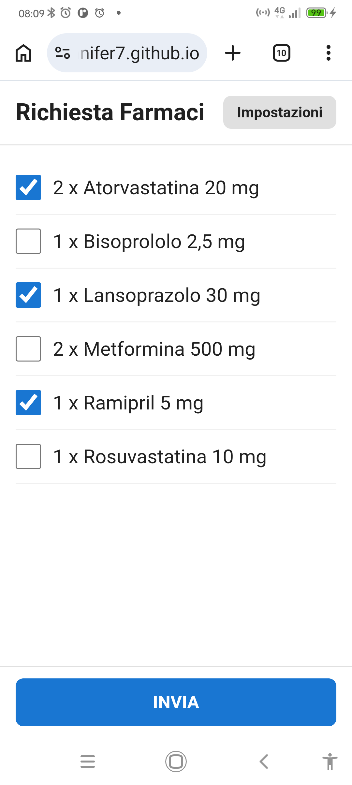

# Richiesta Farmaci — Web App (PWA)

App per inviare al medico la richiesta di rinnovo ricette, via **WhatsApp**, **SMS** o **Email**, nel formato esatto atteso dallo studio medico.

Funziona su **iPhone e Android** direttamente dal browser, senza installazione. Può essere aggiunta alla schermata Home come un'app normale.

## Utilizzo

**Apri nel browser:** [giannifer7.github.io/richiesta-farmaci](https://giannifer7.github.io/richiesta-farmaci/)

### Aggiungere alla schermata Home (opzionale)

- **iPhone (Safari):** tasto Condividi → *Aggiungi a schermata Home*
- **Android (Chrome):** menu ⋮ → *Aggiungi a schermata Home* (o il banner che appare automaticamente)

## Funzionamento



La schermata principale mostra la lista dei farmaci abituali con le checkbox già spuntate sui farmaci da richiedere di default. Si selezionano i farmaci desiderati e si preme **INVIA**: l'app apre WhatsApp, l'app SMS o il client email con il messaggio già compilato nel formato predefinito:

```
Farmaci: COGNOME Nome, 2 x Farmaco A, 1 x Farmaco B, ...
```

In fondo alla schermata viene mostrato un promemoria con la data dell'ultima richiesta inviata (es. *"Ultima richiesta 41 giorni fa (23 gennaio 2026)"*).

## Impostazioni

Nella schermata **Impostazioni** si configurano:

- **Nome** e **Cognome** del paziente
- **Codice Fiscale**
- **Numero di telefono** del medico
- **Email** del medico
- **Metodo di invio**: WhatsApp, SMS o Email
- **Modello messaggio**: testo personalizzabile con segnaposto (vedi sotto)
- **Lista farmaci**: nome, quantità (confezioni) e selezione di default
- **Import da testo**: incolla una lista farmaci (es. dalla risposta del medico) per aggiornare la lista in un colpo solo

### Modello messaggio

Il testo inviato è personalizzabile tramite segnaposto:

| Segnaposto | Valore |
|---|---|
| `{nome}` | Nome del paziente |
| `{cognome}` | Cognome (come inserito) |
| `{COGNOME}` | Cognome in maiuscolo |
| `{cod_fisc}` | Codice fiscale |
| `{lista("sep", {qta} x {farmaco})}` | Lista farmaci con separatore e formato personalizzati |

Il separatore supporta `\n` (a capo) e `\t` (tabulazione). Esempio con farmaci su righe separate:

```
{COGNOME} {nome} - {cod_fisc}
{lista("\n", {qta} x {farmaco})}
```

Il pulsante **Ripristina default** riporta al formato originale:

```
Farmaci: {COGNOME} {nome}, {lista(", ", {qta} x {farmaco})}
```

### Formato farmaci

Ogni farmaco è su una riga. Il prefisso `[x]` indica selezione di default, `[ ]` non selezionato:

```
[x] 2 x Paracetamolo 1000 mg
[ ] 1 x Ramipril 5 mg
```

### Formato import

La sezione *Importa da testo* accetta sia il formato riga per riga (con o senza prefissi) che il formato della risposta del medico:

```
Farmaci: COGNOME Nome, 2 x Farmaco A, 1 x Farmaco B
```

## Build (sviluppatori)

Il sorgente TypeScript si trova in `src/`. Il bundle viene generato con [esbuild](https://esbuild.github.io/).

```bash
npm install
npm run build   # genera index.js, settings.js, medicines.js, sw.js
```

## Privacy / GDPR

I dati personali inseriti (nome, cognome, codice fiscale) sono salvati **solo localmente** sul dispositivo tramite `localStorage`. Non vengono trasmessi a nessun server o servizio esterno.

L'unica trasmissione avviene quando l'utente preme **INVIA**: in quel momento l'app apre WhatsApp, l'app SMS o il client email con il messaggio precompilato, e l'utente lo invia esplicitamente al solo destinatario configurato (il medico).

## Licenza

MIT
